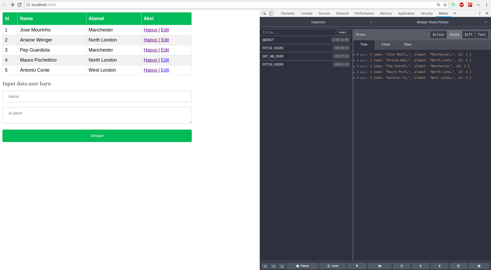
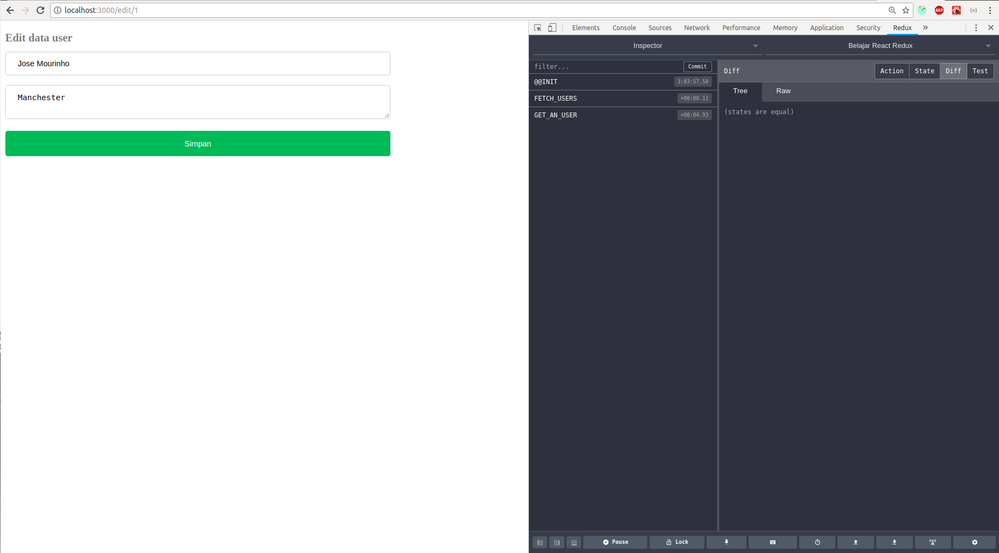

# Belajar React Redux

Aplikasi yang mempunyai fungsionalitas CRUD (Create Read Update Delete) pada data User. Hanya aplikasi kecil sebagai bahan belajar penggunaan redux pada ReactJs. Aplikasi ini dibangun menggunakan boilerplate [create-react-app](https://github.com/facebook/create-react-app).

## Clone atau Download

`git clone git@github.com:facebook/create-react-app.git` atau download manual

## Install Dependencies

`npm install`

## Menjalankan Aplikasi

`npm start`

## Tampilan Aplikasi

